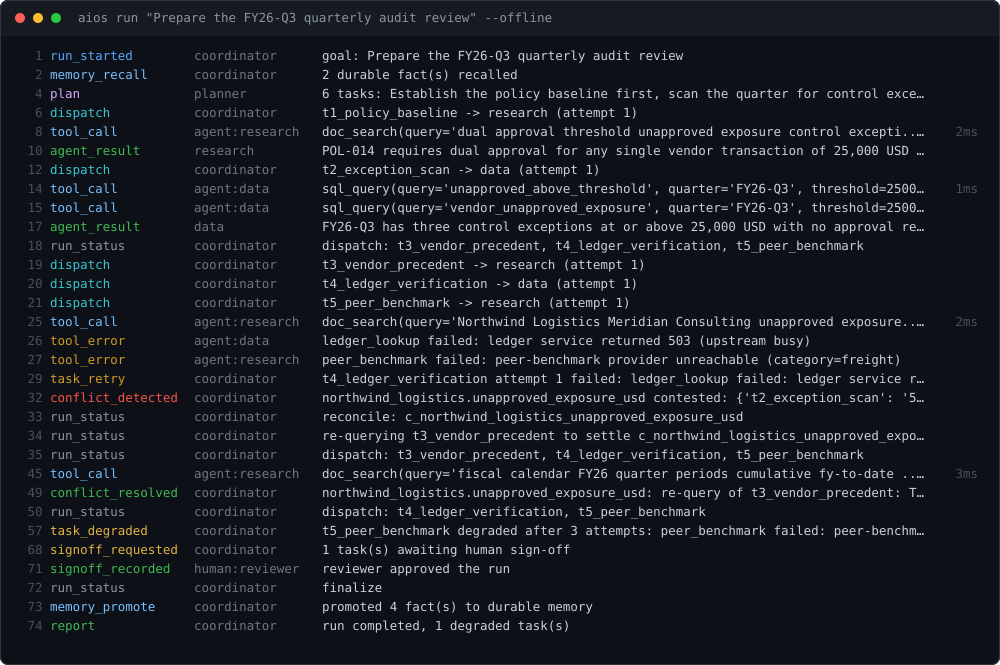
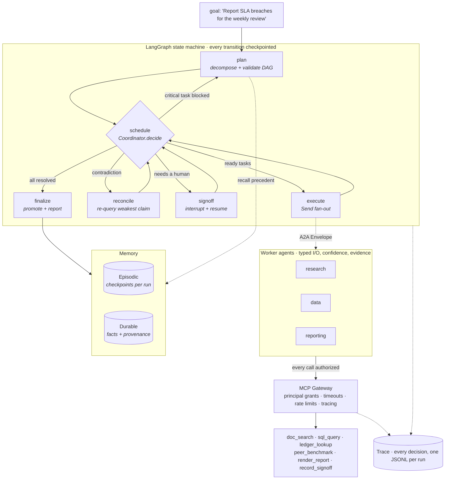

<h1 align="center">Enterprise AI-OS</h1>

<p align="center">
  <b>A LangGraph-based multi-agent orchestration platform.</b><br/>
  Give it a fuzzy, high-level goal. It decomposes the goal into a task graph,<br/>
  runs specialised agents in parallel, reconciles what they disagree on,<br/>
  survives tools being down, and produces a human-reviewable output.
</p>

<p align="center">
  
  
  
  
  
</p>

<p align="center"></p>

<p align="center"><sub>An actual run, not a mockup — generated from a trace file by <a href="tools/trace_to_svg.py"><code>tools/trace_to_svg.py</code></a>.</sub></p>

---

## The problem it solves, in one example

A support team. **Urgent problems must be fixed within 7 days.**

- The **live list of problems** says **8 are overdue**, and Payments has **3** of them.
- **Last Monday's summary** says only **4** are overdue, and nobody needs telling.

The rule is that any team with 3 or more overdue problems is **reported to the
director**. So the two sources disagree, and the disagreement decides whether
the director gets told.

That is the whole project. Five lines of the trace above:

| Trace line | What it proves |
|---|---|
| `plan — 4 tasks` | A sentence became a **validated task graph**. Cycles, unknown dependencies and unknown agents are rejected, and the planner is re-prompted with the reason. |
| `dispatch: t2_live_count, t3_last_summary` | **Two agents at once.** LangGraph `Send` fan-out, one branch per ready task, merged through a state reducer — not a for-loop. |
| `conflict_detected … 8 vs 4` | Two sources disagree about the same number. **Nothing silently picks a winner.** |
| `re-querying t3_last_summary` → `conflict_resolved` | It re-queries the **less confident** source, which finds the summary was written Monday at 08:00, before four more problems went overdue. Resolved, with the reason recorded. |
| `signoff_requested` → `memory_promote` | The run **stops at a checkpoint**, not a prompt loop. Only after a human approves do those findings become durable facts the next run recalls. |

Nothing here needs special knowledge. The `audit` scenario shows more machinery —
a flaky tool that recovers, a dead tool that degrades the run, a replan that
routes around it — but it needs you to know what a control exception is.
| `plan — 4 tasks` | A sentence became a **validated DAG**. Cycles, unknown dependencies and unknown agents are rejected and the planner is re-prompted with the reason. |
| `dispatch: t2_live_breaches, t3_last_report` | **Two agents at once.** LangGraph `Send` fan-out, one branch per ready task, merged through a state reducer — not a for-loop. |
| `conflict_detected … {'t2': '8', 't3': '4'}` | Two sources disagree about the same number. **Nothing silently picks a winner.** |
| `re-querying t3_last_report` → `conflict_resolved` | The **least confident** claimant is re-queried with the contradiction attached. It finds the report was a Monday 08:00 snapshot taken before four tickets aged out. Resolved, with the reason recorded. |
| `signoff_requested` → `memory_promote` | The graph **stops at a checkpoint**, not a prompt loop. Only after a human approves do those findings become durable facts the next run recalls. |

Nothing here needs domain knowledge. The `audit` scenario shows more machinery —
a flaky tool that recovers, a dead tool that degrades the run, a replan that
routes around it — but needs you to know what a control exception is.

---

## Try it in 30 seconds

```bash
python -m pip install -e .
python scripts/start.py demo
```

No API key, no model, no setup: it replays recorded answers against the real
engine, prints every step, and ends with the report and what it chose to
remember.

Then point it at your own files — spreadsheets, PDFs, Word documents:

```bash
aios use C:/work/my-files      # one command: inspects, configures, grants
aios serve                     # the console now reads your data, not the demo
```

The console header shows `domain: my-files` so you can always tell which data is
live. See [docs/your-own-data.md](docs/your-own-data.md).

Only the **model's replies** are replayed. The graph, scheduler, agents,
gateway, memory and checkpointer are the real ones, and the tools really run —
that SQL really executes, those documents are really parsed. Change a row in
`data/support/tickets.csv` and the numbers change.

For a live run, export `ANTHROPIC_API_KEY`, or point at a self-hosted model with
[docs/self-hosted-model.md](docs/self-hosted-model.md).

```bash
aios runs                       # the run index
aios trace <run_id>             # replay the audit trail from disk
aios memory --history           # durable facts, including superseded ones
aios resume <run_id> --approve  # finish a paused run, any time, any shell
```

---

## How it works



Three design decisions carry most of the weight:

**The scheduler is pure policy.** [`coordinator.py`](src/aios/orchestration/coordinator.py)
imports no LangGraph and does no I/O. It takes run state and returns a decision —
dispatch, reconcile, sign-off, replan, finalize or halt. That's why the scheduling
rules are unit-testable on their own, and why the graph file stays thin.

**Agents never talk to each other, and never hold credentials.** Every dispatch is
an [`Envelope`](src/aios/a2a.py), every answer a `Reply`. Every tool call goes through
the [gateway](src/aios/mcp_gateway/gateway.py), which checks the calling principal's
grant *on every call* — an agent asking for a tool outside its grant gets a traced
`access_denied` and a failed task, not data.

**Two independent gates guard durable memory.** A finding is promoted only if a human
approved it **and** it clears a confidence bar. Contradicted facts are superseded, never
overwritten, so the audit trail survives.

---

## The parts

| Capability | Where it lives |
|---|---|
| Goal → validated task DAG, and replanning on failure | [`orchestration/planner.py`](src/aios/orchestration/planner.py) |
| Scheduling, retry, degradation, conflict and escalation policy | [`orchestration/coordinator.py`](src/aios/orchestration/coordinator.py) |
| LangGraph wiring: fan-out, routing, checkpoints, interrupt | [`orchestration/graph.py`](src/aios/orchestration/graph.py) |
| Agent contract: pick tools, then produce a typed result | [`agents/base.py`](src/aios/agents/base.py) |
| A2A envelope and reply | [`a2a.py`](src/aios/a2a.py) |
| Tool authorization, timeouts, tracing | [`mcp_gateway/`](src/aios/mcp_gateway/) |
| Episodic memory: checkpoints and the run index | [`memory/episodic.py`](src/aios/memory/episodic.py) |
| Durable memory: promotion policy and supersession | [`memory/semantic.py`](src/aios/memory/semantic.py) |
| Trace store and replay | [`observability/trace.py`](src/aios/observability/trace.py) |
| Structured-output model client: Claude + deterministic replay | [`llm.py`](src/aios/llm.py) |

Every agent returns the same contract, so the coordinator can validate outputs
programmatically instead of parsing prose:

```python
class AgentResult(BaseModel):
    summary: str
    claims: list[Claim]        # subject / metric / value - what conflict detection compares
    confidence: float          # drives re-query targeting and promotion
    evidence: list[str]        # documents, query names, record ids
```

---

## Failure handling, on demand

Every one of these is a path you can run, not a paragraph in a design doc.

| Failure | What the platform does |
|---|---|
| Tool fails transiently | Bounded retries with exponential backoff, per task |
| Tool down for good, non-critical task | Marked `degraded`, run continues, gap named in the report |
| Tool down for good, critical task | Task `blocked` → planner re-invoked → routes around it |
| Two agents contradict each other | Least confident claimant re-queried; escalated to the human if it survives |
| Planner emits a cyclic or unresolvable DAG | Rejected before dispatch, planner re-prompted with the reason |
| Agent reaches for a tool it wasn't granted | Denied at the gateway, traced, task fails |
| Reviewer isn't at their desk | Run suspends to a checkpoint; resume in another process, another day |
| Report below the confidence bar | Human can approve it and the platform still refuses to promote it |

Watch the last two together:

```bash
# critical tool dead for the whole run -> replan, and a report too weak to promote
aios run "Prepare the FY26-Q3 quarterly audit review" \
  --offline --scenario audit_outage --outage ledger_lookup
```

The blocked task stays visible in the graph as `superseded` — nothing silently
disappears — and `aios memory` stays empty, because the revised report's confidence
lands below the promotion bar.

---

## Tests

```bash
python -m pytest        # 58 passed
```

Policy is tested directly — plan validation, scheduling precedence, retry and
degradation, conflict detection and resolution, gateway authorization and timeouts,
promotion and supersession — and **both scenarios run end to end through the real
graph** in seconds, with zero model spend.

That last part is the useful trick: any run's model calls can be captured as a
fixture and replayed, which turns "the orchestration still behaves correctly" into an
ordinary regression test. Most agent systems can't write that test.

---

## Layout

```
src/aios/
├── a2a.py                    A2A envelope and reply
├── cli.py                    console
├── config.py                 settings (AIOS_* env)
├── llm.py                    structured-output client: Claude + replay
├── runtime.py                wiring, start/resume
├── agents/                   base contract + research, data, reporting
├── mcp_gateway/              registry (principals, grants), gateway, tools
├── memory/                   episodic (checkpoints, run index), semantic (facts)
├── observability/            trace store and replay
├── orchestration/            state, planner, coordinator, graph
└── demo/                     synthetic fixtures + recorded scenarios
```

Runtime data lives under `.aios/` (checkpoints, traces, reports, durable memory) and
`data/` (the synthetic warehouse and policy corpus). Both are gitignored — `aios seed`
regenerates them.

## Docs

**Start here**

- [**ARCHITECTURE.md**](ARCHITECTURE.md) — what the engine is, where it ends, and
  what is scaffolding around it. Read this if the repository looks bigger than
  its idea.
- [**docs/live-demo.md**](docs/live-demo.md) — demoing it, including on data you
  have never seen, and what to say when it breaks.

**Using it**

- [**docs/your-own-data.md**](docs/your-own-data.md) — your folder of
  spreadsheets, PDFs and Word documents. Two commands, no Python.
- [**docs/self-hosted-model.md**](docs/self-hosted-model.md) — vLLM, Ollama,
  llama.cpp: schema handling, model sizing, troubleshooting.

**Going further — optional**

- [**docs/README.md**](docs/README.md) — what hosting it
  for many users takes: queue, leases, tenancy, budgets, cost model.
- [**docs/design.md**](docs/design.md) — the original high-level design.

---

## What this is not

Stated plainly, because a demo that hides its edges isn't worth trusting.

- **Data is synthetic.** `aios seed` generates it. The numbers were chosen so one run
  exercises a policy breach, a cross-source contradiction, a flaky tool and a dead one.
- **One domain so far.** The engine is domain-neutral — state, coordinator, graph,
  gateway, agent base and memory contain no domain vocabulary — but only an audit
  domain is wired up. Generality is claimed, not yet demonstrated.
- **Conflict identity is literal.** Claims are matched on an exact `(subject, metric)`
  pair. `55700.00` and `55,700` do not match. Production needs canonicalisation,
  numeric tolerance and units. This is the weakest load-bearing part of the design.
- **Confidence is self-reported.** Re-query targeting, escalation and promotion all key
  off a number the model reports about itself. Until it's calibrated against outcomes
  it's a heuristic — which is exactly why the human gate is mandatory.
- **Single process, one run at a time.** No queue, no multi-tenancy, no auth beyond
  principal typing. [The production design](docs/README.md) covers what
  changes, and why the orchestration logic doesn't have to.
