# AI-OS — Production Design

*Design notes, v0.1 — the path from the v1 prototype to a service other people depend on*

## What this doc is

v1 works. It plans a goal into a task graph, runs agents in parallel, reconciles
what they disagree on, survives tools being down, stops for a human, and writes
approved findings to durable memory. It does all of that as **one process, on one
machine, for one person at a time.**

This document is about what changes when many people, many tenants and many runs
share the same system — and, just as importantly, what *doesn't* change. It's
written plainly so anyone on the team can read it top to bottom and understand
why each piece is shaped the way it is.

One line to anchor the rest:

> v1 is one process that carries one goal to completion. Production is **a queue
> of runs, a pool of interchangeable workers, and one durable store of record.**
> The orchestration rules themselves — plan, dispatch, reconcile, degrade,
> escalate — do not change at all.

That last sentence is the whole reason this is a small project rather than a
rewrite. The scheduler in v1 is pure policy over state, and the state is already
checkpointed. Scaling is a storage and transport problem, not a logic problem.

---

## 1. Where v1 stops

Honest inventory. Left column is what v1 does, right column is what production
needs and why.

| v1 today | Why it breaks with real users | Production answer |
|---|---|---|
| One run per process, run to completion in the foreground | No concurrency, no crash recovery, the CLI must stay open | Run queue + stateless worker pool with leases |
| SQLite files on local disk for checkpoints, facts and the run index | One writer, one machine, no sharing | Postgres for state, object storage for large payloads |
| Trace written as one JSONL file per run | Cannot answer "how often do conflicts escalate?" across runs | Append-only `trace_events` table + OpenTelemetry spans |
| Settings from `.env`, global to the process | Every tenant would share one policy | Per-tenant policy records, loaded per run |
| Principal is an agent-type string, trusted because the code constructed it | Fine inside one process, meaningless across a network | Principal resolved from a signed token at the edge, never from the payload |
| Tool grants are hard-coded in `build_tools` | Tenants need different tools and different limits | Grants as data, per tenant, per tool |
| Unbounded model spend per run | One pathological run can cost real money | Per-run token and currency budget, enforced before each call |
| Human gate is a terminal prompt | Reviewers are not sitting in your shell | Review API, notification, and a TTL on the pause |
| Durable recall is lexical scoring over a fact table | Fine for hundreds of facts, poor for hundreds of thousands | Hybrid retrieval: keyword + vector, same `recall` interface |
| One synthetic domain (audit review) | Generality is unproven | Domain packs: tools, policies and prompts as configuration |

Nothing in that table requires touching `Coordinator`, `Planner`, the A2A
envelope or the agent contract. That is the point.

---

## 2. Target architecture

Three planes. Keeping them separate is what makes each one scalable on its own.

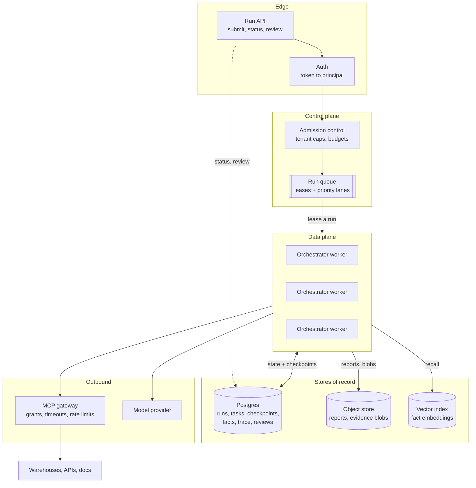

### Why workers are stateless

A worker holds nothing between supersteps. Everything it needs to continue a run
is in the checkpoint. So:

- a worker can die mid-run and another picks it up from the last checkpoint;
- you scale by adding workers, not by making one worker bigger;
- deploying a new version does not need to drain runs, because a run resumed by
  a new worker just continues from state.

This is already true in v1 — `aios resume <run_id>` in a fresh shell finishes a
paused run. Production just makes that the normal path instead of the human path.

### One decision worth making explicitly: where agent work runs

There are two topologies, and it's worth being deliberate rather than drifting.

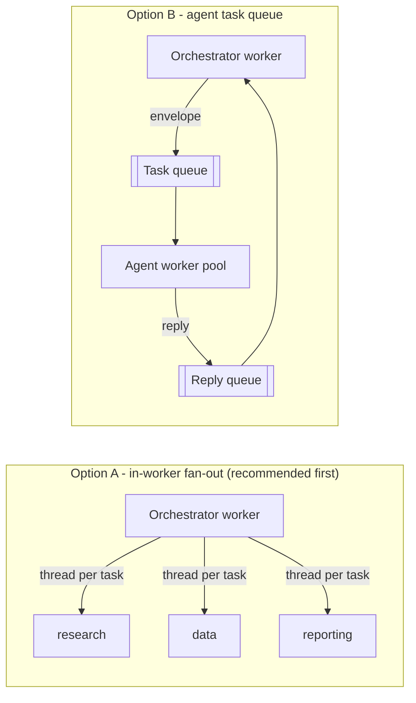

**Start with A.** It's what v1 does (LangGraph `Send` fan-out inside one
superstep), the work is IO-bound waiting on models and tools rather than
CPU-bound, and it needs no extra moving parts.

**Move to B only when one of these is true:** a single task routinely runs longer
than a comfortable lease (say 10 minutes), agents need different hardware or
network zones, or one greedy tenant's tasks must not crowd out another's.

The reason the choice can be deferred is that the seam already exists: every
dispatch is an `Envelope` and every answer a `Reply`. Option B replaces a
function call with a queue between the two — it does not change the coordinator.

---

## 3. What a run is, in production

A run is a row in `runs`, a chain of checkpoints, and a lease. Every transition it
can make, numbered so the labels stay out of each other's way — the legend below
carries the detail a one-word edge label cannot:

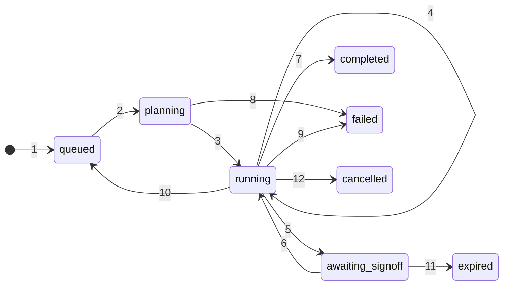

`completed`, `failed`, `expired` and `cancelled` are terminal.

| # | Transition | Trigger | Consequence |
|---|---|---|---|
| 1 | → `queued` | Submitted and admitted | The run exists as a row before any work starts |
| 2 | `queued` → `planning` | A worker takes the lease | Ownership is now time-bounded, not permanent |
| 3 | `planning` → `running` | Plan validated | Nothing dispatches until the DAG is checked |
| 4 | `running` → `running` | Each superstep | A checkpoint is written; recovery granularity is one wave of tasks |
| 5 | `running` → `awaiting_signoff` | Graph interrupts at the gate | The worker is released — a paused run costs no compute |
| 6 | `awaiting_signoff` → `running` | Reviewer decides | Requeued; any worker can pick it up and finish |
| 7 | `running` → `completed` | Finalize | Approved findings promoted, report written |
| 8 | `planning` → `failed` | Plan still invalid after the attempt budget | Nothing was dispatched, so nothing to unwind |
| 9 | `running` → `failed` | No dispatchable work and no replan budget left | Partial results and the reason are preserved |
| 10 | `running` → `queued` | Lease lost — the worker stopped heartbeating | Another worker resumes from the last checkpoint |
| 11 | `awaiting_signoff` → `expired` | TTL elapses with no decision | Draft kept; the run stops holding anything |
| 12 | `running` → `cancelled` | Operator or tenant cancels | In-flight tasks finish or time out; no new ones dispatch |

Two of these carry the reliability story:

**`running --> queued` on lease loss.** If a worker stops heartbeating, the
queue takes the run back and another worker resumes it. Because it resumes from a
checkpoint, no completed task re-runs. This is the crash path, and it is the same
mechanism as the human pause path.

**`awaiting_signoff --> expired`.** A pause with no deadline is a leak. Every
gate carries a TTL. On expiry the run ends in a terminal state with the draft
preserved, rather than sitting in the queue forever holding a lease.

---

## 4. Data models

The v1 models (`Task`, `AgentResult`, `Claim`, `Conflict`, `Signoff`, `Fact`)
stay as they are. Production adds the records that make a run something the
system owns rather than something a shell owns.

```python
from datetime import datetime
from decimal import Decimal
from pydantic import BaseModel, Field


class Budget(BaseModel):
    max_input_tokens: int
    max_output_tokens: int
    max_currency: Decimal          # hard ceiling; the run halts, not overruns
    max_wall_clock_seconds: int
    max_plan_revisions: int = 2
    max_task_attempts: int = 3


class Spend(BaseModel):
    input_tokens: int = 0
    output_tokens: int = 0
    currency: Decimal = Decimal("0")
    tool_calls: int = 0

    def exceeds(self, budget: Budget) -> bool: ...


class Lease(BaseModel):
    worker_id: str
    acquired_at: datetime
    expires_at: datetime           # extended by heartbeat, else the run requeues
    attempt: int                   # how many workers have held this run


class RunRecord(BaseModel):
    run_id: str
    tenant_id: str
    submitted_by: str              # resolved principal, not caller-supplied
    goal: str
    domain: str                    # which tool and policy pack applies
    status: str
    priority: int = 0
    budget: Budget
    spend: Spend = Spend()
    lease: Lease | None = None
    checkpoint_id: str | None = None
    report_uri: str | None = None
    created_at: datetime
    updated_at: datetime
    deadline_at: datetime | None = None


class TaskAttempt(BaseModel):
    """One execution of one task. Append-only - the history is the audit trail."""

    attempt_id: str
    run_id: str
    task_id: str
    attempt: int
    agent: str
    started_at: datetime
    ended_at: datetime | None = None
    outcome: str                   # ok | tool_error | llm_error | timeout | denied
    error: str | None = None
    result_uri: str | None = None  # large results live in the object store
    confidence: float | None = None
    input_tokens: int = 0
    output_tokens: int = 0


class ToolGrant(BaseModel):
    tenant_id: str
    tool: str
    allowed_agents: list[str] = []
    allowed_principal_kinds: list[str] = ["agent"]
    rate_limit_per_minute: int | None = None
    timeout_seconds: float = 20.0
    secret_ref: str | None = None  # vault pointer; never the secret itself


class ReviewRequest(BaseModel):
    review_id: str
    run_id: str
    tenant_id: str
    task_ids: list[str]
    draft_uri: str
    open_conflicts: int
    degraded_tasks: int
    assigned_to: list[str] = []
    expires_at: datetime
    decided_at: datetime | None = None
    decision: "Signoff | None" = None


class TraceEvent(BaseModel):
    """v1's event, plus the fields that make it queryable and correlatable."""

    seq: int
    run_id: str
    tenant_id: str
    trace_id: str                  # OpenTelemetry correlation
    span_id: str
    kind: str
    actor: str
    task_id: str | None = None
    message: str
    duration_ms: int | None = None
    detail: dict = Field(default_factory=dict)   # redacted at emit
    at: datetime
```

And the durable fact gains what a shared store needs:

```python
class Fact(BaseModel):
    fact_id: str
    tenant_id: str
    subject: str
    metric: str
    value: str
    confidence: float
    provenance_run: str
    valid_from: datetime
    valid_to: datetime | None = None    # closed when superseded; row is kept
    superseded_by: str | None = None
    embedding_id: str | None = None     # pointer into the vector index
```

### How it fits together

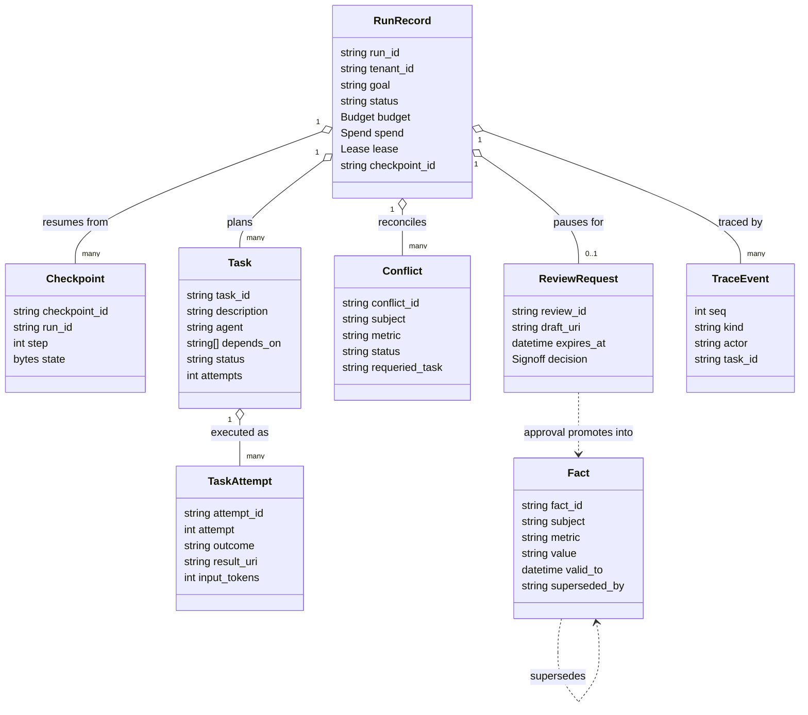

Read the two dotted lines as the governance story. A fact only exists because a
review approved it, and a fact never disappears — it gets closed and pointed at
its replacement.

---

## 5. Interfaces

Same convention as the rest of the codebase: Pydantic models the data that
crosses a boundary, `Protocol` describes the behaviour on the other side. Every
one of these is a seam where the v1 local implementation is swapped for a
networked one without the orchestration code noticing.

```python
from typing import Protocol


class RunQueue(Protocol):
    """Durable work distribution with leases."""

    async def submit(self, record: RunRecord) -> str: ...
    async def lease(self, worker_id: str, lanes: list[str], for_seconds: int) -> RunRecord | None: ...
    async def heartbeat(self, run_id: str, worker_id: str, for_seconds: int) -> bool: ...
    async def release(self, run_id: str, worker_id: str, status: str) -> None: ...
    async def requeue_expired(self, now_before: datetime) -> int: ...


class RunStore(Protocol):
    """The record of what runs exist and what they cost."""

    async def get(self, tenant_id: str, run_id: str) -> RunRecord | None: ...
    async def list(self, tenant_id: str, status: str | None, limit: int) -> list[RunRecord]: ...
    async def update_status(self, run_id: str, status: str, report_uri: str | None) -> None: ...
    async def add_spend(self, run_id: str, delta: Spend) -> Spend: ...
    async def append_attempt(self, attempt: TaskAttempt) -> None: ...


class FactStore(Protocol):
    """Durable memory. Same surface as v1 SemanticMemory, different engine."""

    async def recall(self, tenant_id: str, query: str, limit: int) -> list[Fact]: ...
    async def promote(self, tenant_id: str, claims: list["Claim"], run_id: str,
                      confidence: float, human_approved: bool) -> list[Fact]: ...
    async def history(self, tenant_id: str, subject: str, metric: str) -> list[Fact]: ...


class TraceSink(Protocol):
    """Write path is fire-and-forget; read path is for the console and evals."""

    def emit(self, event: TraceEvent) -> None: ...
    async def query(self, tenant_id: str, run_id: str | None,
                    kinds: list[str], since: datetime | None) -> list[TraceEvent]: ...


class ReviewInbox(Protocol):
    """The human gate, as a service rather than a terminal prompt."""

    async def open(self, request: ReviewRequest) -> str: ...
    async def pending(self, tenant_id: str, reviewer: str) -> list[ReviewRequest]: ...
    async def decide(self, review_id: str, decision: "Signoff", principal: "Principal") -> None: ...
    async def expire(self, now_before: datetime) -> list[str]: ...


class PolicyStore(Protocol):
    """Per-tenant tool grants and budgets, loaded once per run."""

    async def grants(self, tenant_id: str, domain: str) -> list[ToolGrant]: ...
    async def default_budget(self, tenant_id: str) -> Budget: ...


class BudgetMeter(Protocol):
    """Consulted before every model call and every tool call."""

    def check(self, run_id: str) -> None: ...        # raises BudgetExceeded
    def record(self, run_id: str, delta: Spend) -> None: ...
```

The worker itself stays almost exactly the v1 `Runtime`:

```python
class Orchestrator(Protocol):
    async def advance(self, record: RunRecord) -> RunRecord: ...
    async def resume(self, record: RunRecord, decision: "Signoff") -> RunRecord: ...
```

---

## 6. Store design

One table per concern, one engine per access pattern. Postgres is the default for
everything with transactions; the exceptions are called out.

| Store | Engine | Key | Access pattern | Retention |
|---|---|---|---|---|
| Runs | Postgres | `run_id` | Point read, list by tenant + status, lease scan | Live + 13 months |
| Checkpoints | Postgres (LangGraph Postgres saver) | `run_id`, `step` | Write every superstep, read latest | Purge on terminal + 30 days |
| Task attempts | Postgres, partitioned monthly | `attempt_id` | Append, list by run | 13 months |
| Trace events | Postgres, partitioned monthly | `run_id`, `seq` | Append-heavy, range read by run, aggregate by kind | 90 days hot, then cold export |
| Facts | Postgres | `fact_id` | Point read by subject+metric, recall | Indefinite, versioned |
| Fact embeddings | pgvector or a managed index | `embedding_id` | ANN search per tenant | Rebuildable from facts |
| Reports and evidence blobs | Object store | `tenant/run/name` | Write once, read rarely, signed URLs | Per tenant policy |
| Reviews | Postgres | `review_id` | Inbox queries, expiry scan | 13 months |
| Grants and budgets | Postgres | `tenant_id`, `tool` | Read at run start, cached | Live |

### Schema sketch

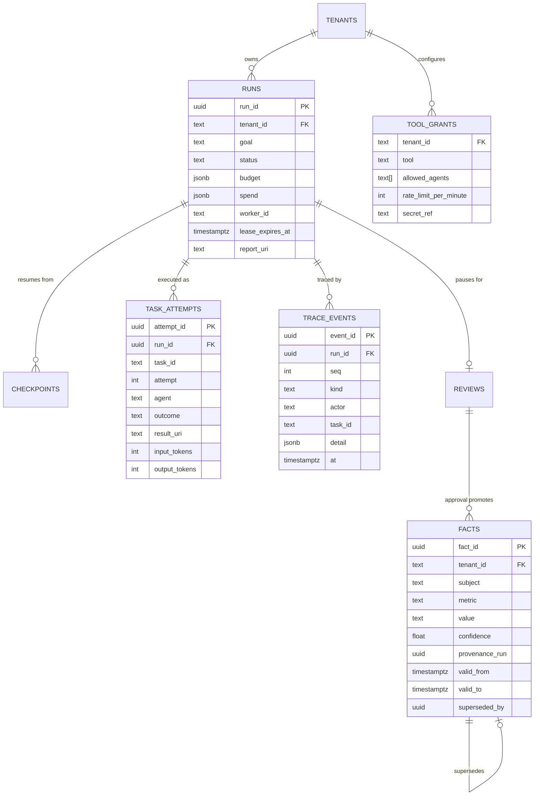

### The four decisions that matter here

**Task attempts are append-only, and separate from task state.** The checkpoint
holds the *current* state of each task; `task_attempts` holds every execution
that ever happened, including the failures. Mixing them makes the checkpoint grow
without bound and makes "why did this cost so much?" unanswerable.

**Large payloads leave the state.** An `AgentResult` with long evidence, and the
rendered report, go to the object store; the checkpoint keeps a URI. Checkpoints
are written on *every* superstep, so anything large in state is written dozens of
times per run. This is the single biggest write-amplification trap in the design.

**Facts are versioned, never updated in place.** `valid_to` plus `superseded_by`
gives point-in-time recall — "what did we believe when this report was signed?"
— which an audit domain genuinely needs, and which an `UPDATE` destroys.

**Every table carries `tenant_id`, and reads go through row-level security.**
Isolation enforced by the database, not by remembering to add a `WHERE` clause.

### Retrieval, properly

v1 recall is term overlap over every fact, which is correct and honest at
hundreds of facts. Production keeps the same `recall` signature and changes the
inside to a three-stage pipeline:

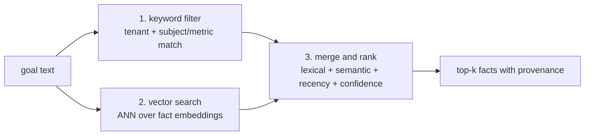

Ranking blends four signals rather than trusting similarity alone: lexical match,
semantic similarity, recency, and the fact's own confidence. Weights are
configuration, not constants — a compliance domain should lean on confidence and
provenance; an operations domain should lean on recency.

---

## 7. How it works, step by step

### 7.1 Submitting a run

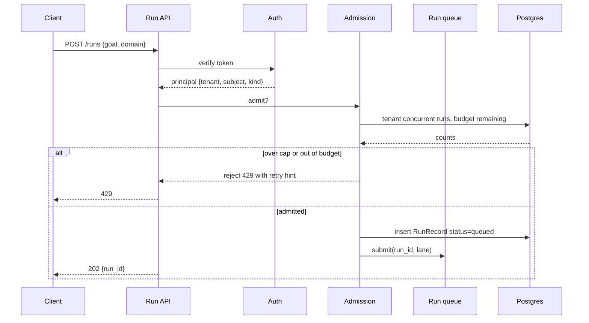

Admission control is deliberately at the edge. Rejecting a run before it exists
is far cheaper than discovering mid-run that a tenant is over budget.

### 7.2 One scheduling superstep

This is the hot loop. It is v1's `schedule → route → execute` cycle with a lease
and a budget check wrapped around it.

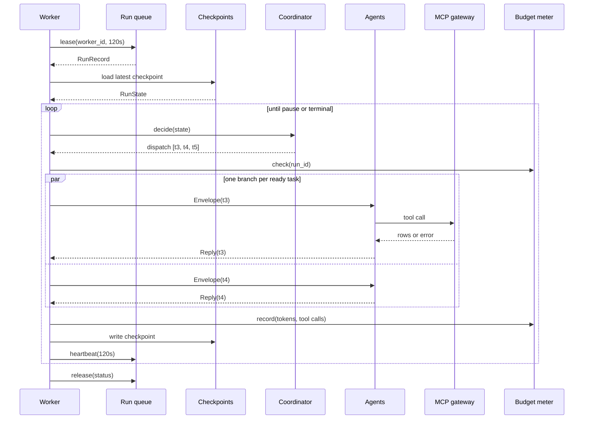

Three rules keep this safe:

- **Heartbeat every superstep, not on a timer.** If a superstep takes longer than
  the lease, the run is genuinely stuck and should be requeued.
- **Budget checked before the wave, spend recorded after.** A wave can overshoot
  by at most one wave, which is bounded and acceptable.
- **Checkpoint after every wave.** Recovery granularity is one wave of tasks.

### 7.3 Reconciling a contradiction

Unchanged from v1 in logic; shown because it's the part people ask about.

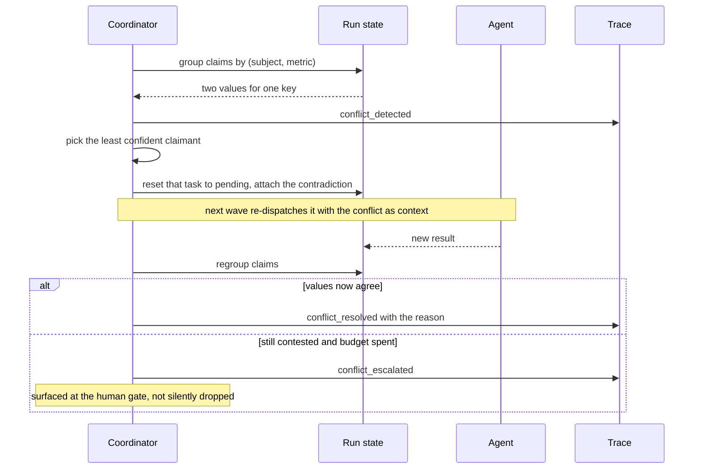

### 7.4 The human gate, as a service

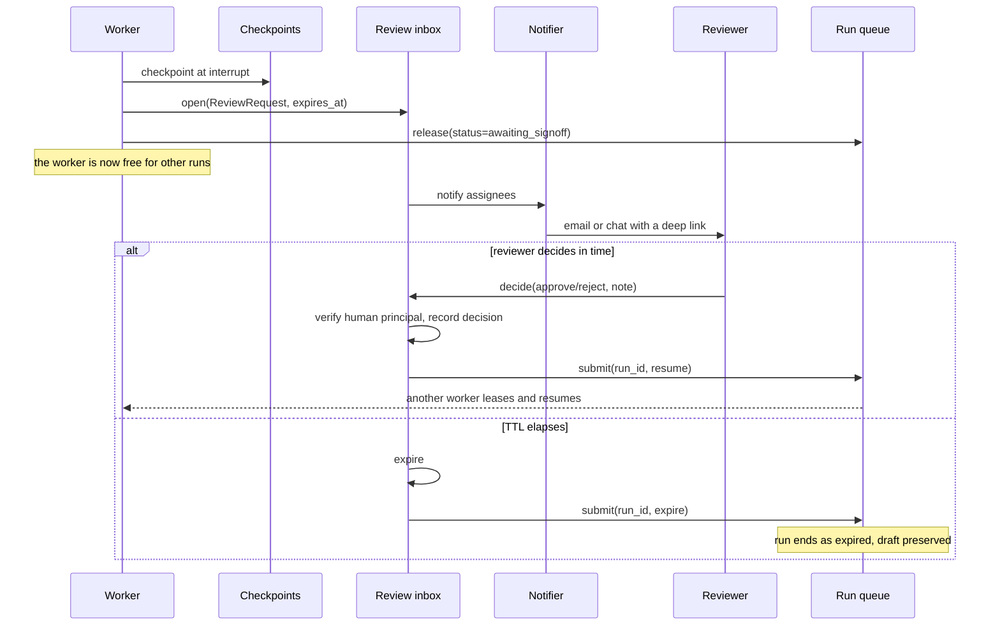

The important property: **a paused run consumes no worker.** In v1 the process
sits there. In production the pause is a row and a queue message, so a run can
wait three days for a reviewer at zero compute cost.

### 7.5 Replanning around a dead tool

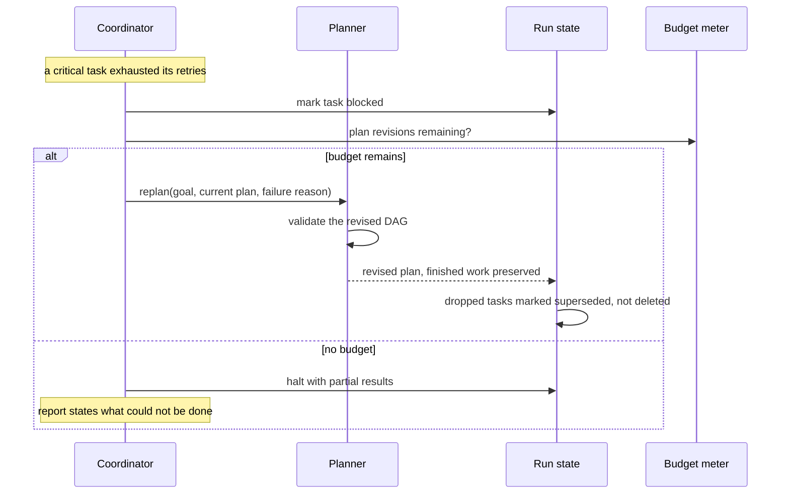

### 7.6 Worker crash and recovery

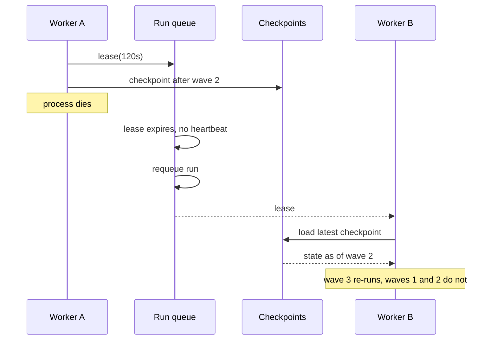

The guarantee is **at-least-once task execution with idempotent effects.** A task
may run twice if a worker dies between executing it and checkpointing. That is
acceptable only because every tool is either read-only or idempotent by run id
— which is a constraint on tool design, and must be stated in the tool contract,
not assumed.

---

## 8. Scaling

### What actually scales, and how

| Dimension | Unit | How it grows | The real ceiling |
|---|---|---|---|
| Runs | Worker processes | Horizontal, stateless, add pods | Model provider rate limits |
| Tasks inside a run | Fan-out width per wave | Capped per run (default 8) | Checkpoint size and tool rate limits |
| Tool traffic | Calls per tool per tenant | Token bucket at the gateway | The upstream system, usually a warehouse |
| Model traffic | Concurrent requests | Global semaphore + per-tenant share | Provider quota and your budget |
| Facts | Rows + vectors | Partition by tenant, ANN index | Index build time, not query time |
| Trace | Events per run | Monthly partitions, cold export | Storage cost, not query cost |

### A capacity model, with the assumptions written down

Assumptions, from the v1 runs, all clearly rough:

- a typical run is 6 tasks and 13 model calls — one planner call plus two per
  task, before retries;
- roughly 8k input and 1k output tokens per call, with the static system prompt
  and tool catalogue cached;
- a run is 3 waves deep, and each wave is bounded by its slowest task.

Then, per run:

- **Tokens:** about 104k input, 13k output.
- **Cost at Opus-tier list rates** ($5 per million input, $25 per million
  output): roughly **$0.85 per run**, dropping to around **$0.45** once the stable
  prompt prefix is cached. Re-check the rates before quoting them; they move.
- **Wall clock:** 2 to 4 minutes, dominated by model latency, not compute.

Because a run is almost entirely *waiting*, one worker should host many runs
concurrently rather than one:

- one worker, async, 10 concurrent runs → roughly **150–200 runs per hour**;
- ten workers → 1,500–2,000 runs per hour → about **$700–1,700 per hour** in
  model spend at the rates above.

**The honest conclusion from that arithmetic:** you will hit the provider's rate
limit and your own budget long before you hit CPU or database limits. So the
scaling work that pays off is not more workers — it is admission control,
budgets, prompt caching, and routing cheap steps to a cheaper model. Compute is
not the constraint. Money is.

### Where the money goes, and what to do about it

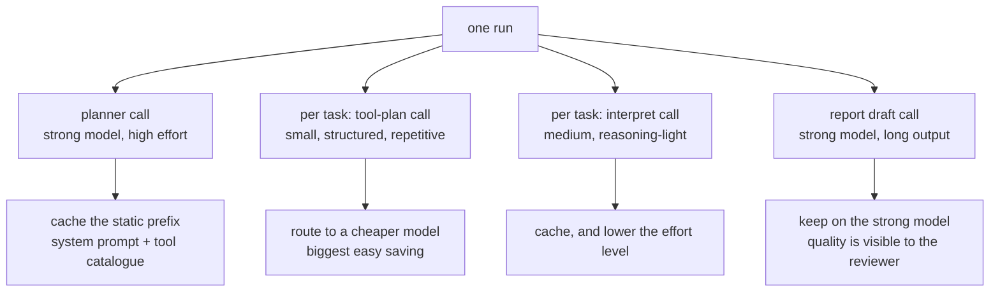

Order of attack, cheapest first: cache the stable prefix (system prompt and tool
catalogue are identical across every task of a domain), route the tool-plan step
to a small model since it is a constrained structured choice, lower effort on
interpretation, and leave planning and the final report on the strong model where
quality is visible to the reviewer.

### Backpressure and fairness

- **Priority lanes** on the queue: interactive, batch, backfill. A nightly
  backfill must never delay a reviewer waiting on a resume.
- **Per-tenant concurrency cap** enforced at admission, so one tenant cannot
  occupy the whole worker pool.
- **Queue depth as the shed signal.** Past a threshold, new batch submissions are
  rejected with a retry hint rather than silently queued for an hour.
- **Per-tool token buckets** at the gateway, so a fan-out wave cannot hammer a
  warehouse.

---

## 9. Reliability

| Failure | How it's detected | Behaviour | Guarantee |
|---|---|---|---|
| Tool call fails transiently | Exception at the gateway | Bounded retries with backoff; non-critical task degrades, critical task blocks | No silent success |
| Tool down for good | Retries exhausted | Critical task blocks, planner routes around it | Run completes degraded or halts honestly |
| Model call fails or is refused | Typed SDK error, or a refusal stop reason | Task retry; refusal surfaces as a task error, never as an empty result | No fabricated output |
| Worker crashes | Lease expiry, no heartbeat | Run requeued, resumed from checkpoint | At-least-once tasks, no lost runs |
| Poison run — loops or blows up | Budget meter, wave counter, deadline | Halted with partial results and a stated reason | Bounded cost per run |
| Database failover | Connection errors | Worker releases the lease and exits; run requeues | No partial checkpoint applied |
| Queue unavailable | Submit fails | API returns 503; nothing half-created | Run either exists or does not |
| Reviewer never responds | TTL scan | Run expires, draft preserved, notification sent | No indefinite pause |
| Replan loop | Plan revision budget | Halt after N revisions | Bounded planning cost |

Two guarantees to state plainly, because they are what someone will ask:

1. **A run never silently loses a task.** Every task ends in a terminal state
   that appears in the report — done, degraded, superseded or blocked.
2. **Nothing enters durable memory without two independent gates** — a human
   approval and a confidence threshold. Either one can veto.

---

## 10. Security and multi-tenancy

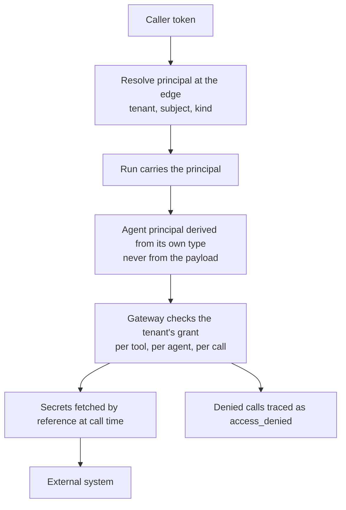

- **Principal is never caller-supplied.** v1 already builds it from the agent's
  own type; production adds a signed token at the edge for humans and services.
- **Grants are per tenant, checked on every call** — not once at connection.
- **Agents hold no credentials.** The gateway resolves a `secret_ref` from the
  vault at call time; secrets never enter agent context or a trace.
- **Human-only tools stay human-only.** Recording a sign-off requires a human
  principal, so an agent cannot approve its own work. This is already enforced
  and tested in v1.
- **Isolation in the database** via `tenant_id` plus row-level security, and a
  separate embedding namespace per tenant, so recall cannot cross tenants.
- **Redaction at emit.** The trace is the audit record, so what goes into
  `detail` is filtered where it is written, not where it is read. Tool arguments
  are elided by length already; production adds field-level rules per tool.
- **Egress is allowlisted.** Tools reach named systems. There is no
  fetch-any-URL tool, because that is an exfiltration path with extra steps.

---

## 11. Observability and quality

Three layers, and the middle one is the one most systems skip.

**Pipeline health** — queue depth and age, runs per hour, lease requeue rate,
worker saturation, p50/p95 run duration, error rate by cause.

**Decision quality** — computed straight off the trace, per domain, per week:

| Signal | What a bad number means |
|---|---|
| Plan rejection rate | Prompt or schema drift in the planner |
| Task retry rate by tool | A flaky dependency, or bad arguments from the model |
| Degraded tasks per run | Tools you depend on are not reliable enough |
| Conflicts per run, and resolve vs escalate ratio | Agents disagree more than the domain warrants, or reconciliation is not working |
| Plan revisions per run | Planning is not accounting for real failure modes |
| Promotion rate, and supersession rate | Durable memory is filling with noise, or being rewritten too often |
| Reviewer agreement rate | The reports are not trustworthy enough to sign |
| Cost and tokens per completed run | The regression you notice last and pay for first |

**Output quality** — offline, in CI. This is where v1's replay mechanism becomes
a real asset rather than a demo convenience:

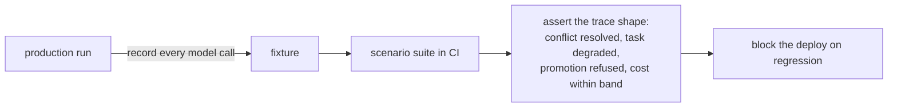

Any real run can be captured as a replayable scenario. That turns "the
orchestration still behaves correctly" into an ordinary regression test that runs
in seconds with no model spend — which is exactly the test most agent systems
cannot write.

Suggested starting SLOs: 99% of submitted runs reach a terminal state; 95% of
interactive runs reach the gate within 10 minutes; zero promotions without a
recorded human decision (this one is a hard invariant, not a target).

---

## 12. Rollout plan

Each phase ships something usable and is testable on its own. Nothing here
requires changing the coordinator, the planner or the agent contract.

| Phase | What ships | Done when |
|---|---|---|
| 1. Storage | Postgres for checkpoints, runs, facts and trace. Large payloads to object storage. Still one worker. | An existing scenario run passes end to end against Postgres, and a run started on one machine resumes on another |
| 2. Service | Run API, queue with leases and heartbeats, worker pool, requeue-on-crash | Killing a worker mid-run loses no work; two workers process two runs concurrently |
| 3. Tenancy | Principal from signed tokens, per-tenant grants and budgets, row-level security, admission control | A tenant cannot read another's runs or facts; an over-budget run halts with partial results |
| 4. Review | Review inbox, notifications, deep links, TTL expiry | A paused run holds no worker and expires cleanly; sign-off requires a human principal |
| 5. Quality | Hybrid retrieval behind `recall`, decision-quality dashboard, recorded-scenario suite in CI | Recall quality measured against a labelled set; a deliberate regression fails CI |
| 6. Optional | Agent task queue, per-agent pools, domain packs as configuration | Only if task duration or tenant isolation demands it |

Rough shape: phases 1 and 2 are the substantial ones. Phases 3 to 5 are each
smaller than they sound because the seams already exist. Phase 6 may never be
needed.

---

## 13. Open questions

The things genuinely not settled. None of them block phase 1.

- **Conflict identity is too literal.** Claims are matched on an exact
  `(subject, metric)` string pair with an exact value comparison. `55700.00` and
  `55,700` do not match; neither do `exposure_usd` and `unapproved_exposure`.
  Production needs value canonicalisation, numeric tolerance, and units — and
  probably a per-domain vocabulary of metrics rather than free-form strings. This
  is the weakest load-bearing part of the current design.
- **Is confidence calibrated?** Retry targeting, promotion and escalation all key
  off a number the model reports about itself. Until that is checked against
  outcomes, treat it as a heuristic and keep the human gate mandatory.
- **Fan-out width versus checkpoint size.** Wider waves finish sooner but write
  bigger checkpoints more often. The right cap is measured, not guessed.
- **Who reviews what.** Assignment is currently a list of names. Real
  organisations need routing by domain, amount, or risk tier — and an escalation
  path when the assignee is on leave.
- **Consolidation of durable memory.** Facts accumulate. There is no policy yet
  for compaction, for expiring facts nobody has recalled in a year, or for
  detecting that two subjects are the same entity under different names.
- **Do agents need their own pool?** Depends entirely on whether task duration
  grows. Deferred deliberately, and cheap to change because of the envelope.
- **Should the planner learn from traces?** Tempting, and the trace has the data.
  But it needs labels — which plans actually produced signed-off reports — and
  that means waiting for enough real reviews to exist.
- **Data residency.** Multi-region changes the store design materially. Worth
  deciding before phase 1 rather than after, if any tenant will require it.
